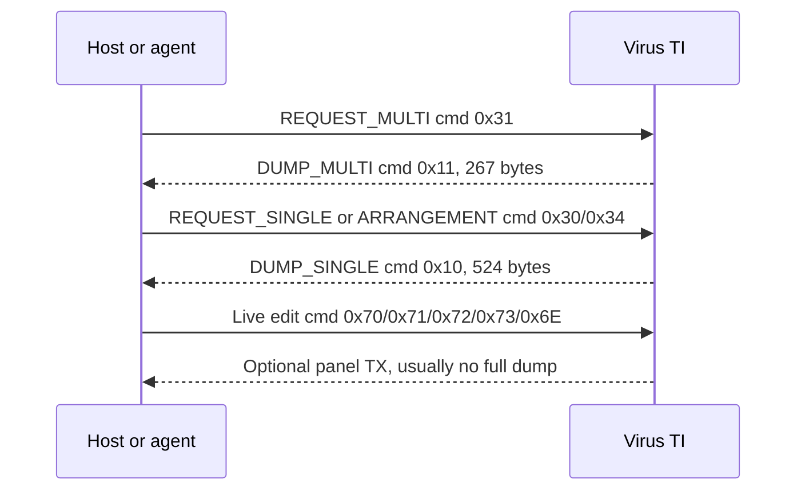

# Access Virus SysEx

Reverse-engineered **Access Virus TI mk2 desktop** SysEx notes, hardware
captures, and mapping worksheets. The repo documents how to request dumps,
parse `DUMP_SINGLE` / `DUMP_MULTI`, send live parameter edits, and record which
observations are confirmed on hardware versus inherited from older Virus docs.

## Setup

Install [Homebrew](https://brew.sh/) MIDI helpers:

```bash
brew install sendmidi receivemidi
```

List ports:

```bash
sendmidi list
receivemidi list
```

Use **`Virus TI USB Plugin I/O`** for both directions (VST/plugin path). Use
`Virus TI USB External I/O` only when controlling the synth from a standalone
keyboard rig, not through the plugin.

Send SysEx with **`hex`** before **`syx`**, and **omit `F0`/`F7`** (sendmidi
adds them). Bare decimals are wrong (`20` → `0x14`); `0x20` parses as **0**:

```bash
# Part 1 Hold Pedal off (11 bytes on wire: F0 + 9 data + F7)
sendmidi dev "Virus TI USB Plugin I/O" hex syx \
  00 20 33 01 00 72 00 4a 00

# Listen for replies (e.g. DUMP_MULTI)
receivemidi dev "Virus TI USB Plugin I/O" dump
```

Message formats: [multis-live-edit.md](docs/multis-live-edit.md),
[multis-dump.md](docs/multis-dump.md),
[single-live-edit.md](docs/single-live-edit.md), and
[single-dump.md](docs/single-dump.md). For classic request tables see
[docs/waf80.md](docs/waf80.md). For agent/hardware test workflows see
[docs/testing.md](docs/testing.md).

## Reading the documentation

Access Virus SysEx is standard MIDI: one message per `F0 … F7` frame. The
docs use the same byte layout you see in a MIDI monitor or in `sendmidi hex
syx` (without the `F0`/`F7` wrappers — sendmidi adds those).

The core split is **request / dump / live edit**:



Use the dump docs when you need a byte offset in a saved program. Use the
live-edit docs when you need to change one parameter now. Use
[docs/testing.md](docs/testing.md) to prove that the two views agree before
promoting a mapping.

### One message, byte by byte

```text
F0  00   20   33  01   00   <cmd>  <payload>   F7
│   └─ Access ─┘  │    │    │                  │
│                 fam  dev  command + data     |
start             (TI) ID                      end
```

| Bytes       | Role                                                                |
| ----------- | ------------------------------------------------------------------- |
| `F0` / `F7` | SysEx start / end (omit when using `sendmidi hex syx`)              |
| `00 20 33`  | Access Music manufacturer ID                                        |
| `01`        | Family (TI series)                                                  |
| `00`        | Device ID (`00`–`0F` = unit 1–16; match your synth)                 |
| **`<cmd>`** | **What kind of message this is** (see below)                        |
| _rest_      | Depends on command: bank/slot, parameter bytes, or a full dump body |

Placeholders like `<part>`, `<param>`, and `<value>` are **one byte each** in
the real message (shown as hex). Example — change one live parameter:

```text
F0 00 20 33 01 00 72 <part> <param> <value> F7
```

`sendmidi` (no `F0`/`F7`):

```bash
sendmidi dev "Virus TI USB Plugin I/O" hex syx 00 20 33 01 00 72 00 4a 00
#                                                             │  │  │  └── value (0 = Off)
#                                                             │  │  └─────── param 0x4A
#                                                             │  └──────────── part 0 = Part 1
#                                                             └──────────────── cmd 0x72
```

### What `cmd=0x71` (and similar) means

In the docs, **`cmd=0x71`** means: the **command byte** at that position in
the SysEx is **`71` hexadecimal** (decimal 113). It tells the synth how to
interpret the bytes that follow — **not** a MIDI note or a UI percentage by
itself.

Rough groups:

| Command byte                  | Typical role                                                | Example                                                                                      |
| ----------------------------- | ----------------------------------------------------------- | -------------------------------------------------------------------------------------------- |
| **`0x30`–`0x37`**             | **Requests** — ask the synth to **send** data back          | `0x30` = request one Single; `0x34` = request arrangement (Multi + 16 Singles)               |
| **`0x10`**, **`0x11`**        | **Dumps** — synth **replies** with a stored snapshot        | `0x10` = `DUMP_SINGLE` (524 bytes on TI); `0x11` = `DUMP_MULTI` (267 bytes)                  |
| **`0x70`–`0x73`**, **`0x6E`** | **Live edit** — change **one** parameter now (no full dump) | `0x71` = edit a Single “Page B” parameter; `0x72` = Multi/common; `0x6E` = part sound buffer |

So **`cmd=0x71`** in [single-live-edit.md](docs/single-live-edit.md) is **live
parameter edit** on classic Page B (e.g. Smooth Mode `param 0x19`), not
“dump single” and not “dump arrangement”. **`cmd=0x10`** is the opposite
direction: a **full Single program** coming back from a request or save.

Full classic tables: [docs/waf80.md](docs/waf80.md).

### What `0x23`-style values mean

**`0x` prefix = one byte written in hexadecimal** (0–255). On the wire,
MIDI SysEx data bytes are almost always **7-bit** (`00`–`7F` = 0–127).

The same notation is used for **different roles** — context tells you which:

| In docs                                | Meaning                                                         | Example                          |
| -------------------------------------- | --------------------------------------------------------------- | -------------------------------- |
| **`cmd=0x72`**                         | Command byte in the **message header**                          | Live Multi edit                  |
| **`param 0x4A`** / **`0x72` / `0x4A`** | **Parameter index** in a live-edit message                      | Hold Pedal enable                |
| **`<value> 00`**                       | **Parameter value** in a live-edit message                      | Off / 0% / minimum               |
| **`0x29`**, **`0x0D..0x16`**           | **Offset** inside a **dump** (byte index from start of `F0`)    | “Part bank lives at byte `0x29`” |
| **`bank 01`**, **`slot 40`**           | **Address** bytes in requests/dump headers (which program slot) | RAM A program 0 → `01` `00`      |

**Offsets** (`0x29`, `0x209`, …) are **positions in the 524- or 267-byte
dump file**, not separate MIDI messages. **Live-edit** lines like
`71 00 19 00` are **not** offsets — they are **param** and **value** bytes
right after `cmd` and `part`.

Some parameters use **encoded** values (not “what you see on the LCD”):

- Direct **`0`–`127`** (e.g. Reverb Send)
- **Bipolar**: `stored = ui + 64` (UI −64 → byte `00`)
- **Tempo**: `stored = bpm − 63`

The parameter map tables mark **Live edit** as command + param (e.g.
`71` / `0x19`) and **Dump offset** as a hex position when known.

### Requests vs dumps vs live edits

```text
# Request: “send me the edit-buffer Multi” (you receive DUMP_MULTI 0x11)
F0 00 20 33 01 00 31 00 7f 7c F7

# Request: “send arrangement” → DUMP_MULTI + 16 × DUMP_SINGLE
F0 00 20 33 01 00 34 00 F7

# Reply fragment: start of a Single dump (cmd 0x10, bank 00, slot = part 1)
F0 00 20 33 01 00 10 00 00 … F7

# Live edit: set one parameter (no full program transfer)
F0 00 20 33 01 00 71 00 19 00 F7
```

Not everything is SysEx: some controls use **MIDI CC** only (e.g. Patch
Volume = CC 91). See [docs/control-change.md](docs/control-change.md).

## Glossary

| Term                    | Meaning                                                                                  |
| ----------------------- | ---------------------------------------------------------------------------------------- |
| `cmd`                   | Command byte after manufacturer/family/device bytes; selects request, dump, or edit type |
| `param`                 | Parameter ID within the selected command/page; not globally unique                       |
| `value`                 | One 7-bit data byte, usually `00`–`7F`; encoding depends on the parameter                |
| Offset                  | Byte position in a full SysEx frame, including `F0` at `0x00`                            |
| Payload-relative offset | Offset inside the dump body only; subtract the documented header size                    |
| Bank                    | Program storage group, e.g. RAM A-D, ROM A-Z, or edit-buffer bank `00`                   |
| Slot                    | Program or Multi position within a bank                                                  |
| Program                 | Single sound number stored or referenced by a Multi part                                 |
| Part index              | Zero-based live-edit part byte: `00` = Part 1, `0F` = Part 16                            |
| Edit buffer             | Temporary current state, not necessarily a stored program slot                           |
| Arrangement             | Multi snapshot plus sixteen part Singles                                                 |
| Checksum                | Final data byte before `F7` on dump replies and some requests                            |
| AURA / VC / OsTIrus     | Host software or emulator sources; verify with hardware before promoting mappings        |

## Documentation index

| You need to…                                 | Start here                                                                               |
| -------------------------------------------- | ---------------------------------------------------------------------------------------- |
| Install MIDI tools and capture hardware data | [docs/testing.md](docs/testing.md)                                                       |
| Understand banks, slots, and play modes      | [docs/virus.md](docs/virus.md)                                                           |
| Request a Multi or parse `DUMP_MULTI`        | [docs/multis-dump.md](docs/multis-dump.md)                                               |
| Send live Multi edits (`0x72`, `0x71`, etc.) | [docs/multis-live-edit.md](docs/multis-live-edit.md)                                     |
| Request arrangement Singles or parse Singles | [docs/single-dump.md](docs/single-dump.md)                                               |
| Send live Single / part sound edits          | [docs/single-live-edit.md](docs/single-live-edit.md)                                     |
| Work with device-wide settings               | [docs/global-live-edit.md](docs/global-live-edit.md)                                     |
| Identify controls that are MIDI CC only      | [docs/control-change.md](docs/control-change.md)                                         |
| Look up option labels and enum values        | [docs/parameter-option-lists.md](docs/parameter-option-lists.md)                         |
| Compare against the classic 1999 map         | [docs/waf80.md](docs/waf80.md)                                                           |
| Account for AURA / host plugin behavior      | [docs/aura-notes.md](docs/aura-notes.md)                                                 |
| Inspect the INIT arrangement capture         | [artifacts/sysex/init-multi-arrangement.syx](artifacts/sysex/init-multi-arrangement.syx) |
