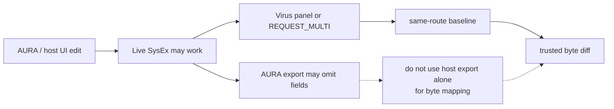

# AURA Plugin Notes

[Docs index](README.md) · [Root README](../README.md)

Notes about the **Access Virus TI AURA plugin** (host software). For SysEx
the **Virus TI mk2** responds to regardless of host, see the other docs in
[README — Documentation index](../README.md#documentation-index).

**Version referenced here:** **26.05.17** (Virus TI mk2 desktop).

## MIDI path

AURA (and the Virus TI plugin) expose **`Virus TI USB Plugin I/O`** for
host ↔ synth traffic. Hardware testing in [testing.md](testing.md) uses
that port, not **External I/O**.

## Export and diff baselines

AURA-exported **`DUMP_MULTI`** files can differ from **Virus panel** dumps
even when the patch sounds the same. When diffing captures:



| Difference               | Typical cause                          |
| ------------------------ | -------------------------------------- |
| `0x08` slot `7F` vs `00` | Edit-buffer / export header convention |
| `0x0C`, `0x26`           | Edited-part context in export          |

Prefer **Virus panel edits + `REQUEST_MULTI` / panel dump** for byte mapping.
See [Workaround for dump mapping](#workaround-for-dump-mapping) below.

**Stored Multi bank requests** from AURA use bank **`01`**, slot = slot
number, **no checksum** byte on the request (TI still replies with
`DUMP_MULTI`).

## Discovered bugs

Issues observed with AURA **26.05.17** on a Virus TI mk2. Live SysEx
(`cmd=0x72` / `0x6E`) often works even when the **267-byte `DUMP_MULTI`**
export does not reflect the change.

### Parameters not persisted in multi dump

| Parameter          | Live SysEx                      | Multi dump (`DUMP_MULTI`)          | Notes                                                                           |
| ------------------ | ------------------------------- | ---------------------------------- | ------------------------------------------------------------------------------- |
| Part Transpose     | Works (`0x72` / `0x25`)         | Not saved from **AURA export**     | Virus hardware dump: `0x79 + part`, `stored = ui + 64` — map via Virus panel    |
| Part Output        | Works (`0x72` / `0x29`)         | Not saved from AURA                | Change on Virus front panel, then dump                                          |
| Low Key / High Key | Works (`0x72` / `0x23`, `0x24`) | Not saved from AURA                | Use Virus + dump to map (`0x59`, `0x69`)                                        |
| Volume RX          | Works (`0x72` / `0x49`)         | Only via `0xF9` `+2` if RX left on | AURA turns RX off when Init Vol → `0`; use Virus to capture RX without Init Vol |

## UI naming (AURA)

| AURA label       | Synth parameter                                                               |
| ---------------- | ----------------------------------------------------------------------------- |
| **Part Level**   | Multi **Volume** (`0x99 + part`, live `0x27`) on Edit Multi page              |
| **Patch Volume** | Edit Single → Common; **CC 91 only** — [control-change.md](control-change.md) |

AURA may display the **stored** byte value (e.g. `100` = `0x64`)
while the Virus panel shows **bipolar** UI (e.g. `+36` where `0x64`
= `36 + 64`).

### Menu paths (AURA vs Virus panel)

| Parameter                                   | AURA menu            | Virus panel (hardware-tested)                      |
| ------------------------------------------- | -------------------- | -------------------------------------------------- |
| Key Mode / Oscillator Section Keyboard Mode | Edit Single → Common | **Oscillators** → **EDIT** → Common → **Key Mode** |
| Bend Up / Bend Down                         | Edit Single → Common | Same Common area via panel                         |
| Patch Volume                                | Edit Single → Common | Edit Single → Common                               |
| Patch Transpose                             | Edit Single → Common | Edit Single → Common                               |

Key Mode enum was confirmed via **CC 94** in AURA and **`cmd=0x70`** /
`0x5E` on the Virus panel when Page A = SysEx — see
[single-live-edit.md](single-live-edit.md#key-mode-0x5e-cmd0x70--cc-94).

## Multi mixer UI (host software)

| Control           | Virus Control | AURA | Notes                                                                                             |
| ----------------- | ------------- | ---- | ------------------------------------------------------------------------------------------------- |
| Direct Monitoring | Yes           | No   | Analog outs direct, bypassing USB/DAW return — [multis-dump.md](multis-dump.md#direct-monitoring) |
| Solo              | No            | Yes  | UI-only: toggles **Enable** (`0x48`) on other parts — not a separate SysEx param                  |
| Mute              | Yes           | Yes  | No dedicated dump byte (likely **Enable** off)                                                    |

## UI coupling (AURA)

| Behavior                    | Notes                                                          |
| --------------------------- | -------------------------------------------------------------- |
| Init Volume → **Off** (`0`) | AURA also sets **Volume RX** to **Disabled** automatically     |
| Smooth Mode → **Off**       | AURA **26.05.17** cannot send Off; Virus accepts `71 00 19 00` |

When capturing Init Volume, note **Volume RX** on the panel after
setting Init Volume — do not assume RX stayed enabled.

## Live SysEx paths used by AURA

These are **Virus commands**; AURA is one host that sends them. Other
hosts (or the Virus panel) may use the same or different `cmd` bytes.

### `cmd=0x71` instead of `0x72`

Some edits AURA sends on Multi pages use **`cmd=0x71`** (classic Page B)
with the same `<part> <param> <value>` layout as **`0x72`**. The Virus
panel uses **`0x71`** for Bend Up/Down on hardware as well — see
[multis-live-edit.md](multis-live-edit.md#bend-up-0x1a-cmd0x71).

### Secondary Output (`cmd=0x73`)

AURA routes **Secondary Output** via global **`cmd=0x73`**, param **`0x2D`**
(not `0x72`). Example captures (Part 1 selected in AURA):

```text
F0 00 20 33 01 00 73 00 2D 00 F7   # Off
F0 00 20 33 01 00 73 00 2D 01 F7   # Out 1 L
F0 00 20 33 01 00 73 00 2D 0A F7   # USB 1 L
```

Virus also accepts **`72 00 2D`** on the wire; neither changes
`DUMP_MULTI` vs INIT baseline on desktop (see [testing.md](testing.md)).

### Global live edit (`cmd=0x73`)

Most entries in [global-live-edit.md](global-live-edit.md) were first
captured from **AURA → Virus** traffic. **All Delays** (`0x1B`) is also
known to transmit from the **Virus front panel**.

| Param                 | AURA-only capture? | Notes                                                                          |
| --------------------- | ------------------ | ------------------------------------------------------------------------------ |
| `0x5D` MIDI Device ID | Yes (so far)       | Not seen when changed on Virus panel; envelope `<device_id>` must match CONFIG |
| Others                | Often AURA-first   | Re-verify on hardware where **Hardware TX** is blank in global-live-edit       |

AURA may use non-default **`<device_id>`** in the envelope when CONFIG
MIDI Device ID is not 1.

### Part enable → `DUMP_SINGLE`

When a part is **disabled then re-enabled** in AURA, the host receives a
**524-byte** `cmd=0x10` (`DUMP_SINGLE`) for that part’s sound (edit buffer
load). Behavior is host-driven, not a documented Virus request reply.

## Control inventory source

The parameter worksheets in [single-dump.md](single-dump.md) and
[multis-dump.md](multis-dump.md) were built from Virus Control / AURA /
OsTIrus inventories. **VC / AURA / OsTIrus availability columns** are not
duplicated in those docs — only synth parameters and SysEx mapping.

## Workaround for dump mapping

When AURA does not persist a field into the 267-byte export:

1. Load multi in AURA as usual.
2. Change the parameter on the **Virus hardware** (or confirm via
   live SysEx that the synth received the edit).
3. Request / capture **`DUMP_MULTI`** (`cmd=0x11`, 267 bytes) from the Virus.

Capture baselines the same way (Virus panel or `REQUEST_MULTI`) when
comparing bytes.

## TI ↔ classic correlation (AURA session)

Observed during AURA **26.05.17** sessions on TI mk2 desktop (see
[waf80.md](waf80.md)):

| Observation                    | Classic map                                              |
| ------------------------------ | -------------------------------------------------------- |
| `72 00 4A` Hold Pedal          | Page **C**, param **74** (0x4A) — Part Hold Pedal Enable |
| `71 00 1A` / `1B` Bend Up/Down | Page **B** params **26** / **27** — Bender Range Up/Down |
| `71 00 19` Smooth Mode         | Page **B** param **25** — Control Smooth Mode            |
| `71 00 1C` Bender Exponential  | Page **B** param **28** — Bender Scale                   |
| CC **91** Patch Volume         | Page **A** param **91**                                  |
| CC **94** Key Mode             | Page **A** param **94**                                  |
