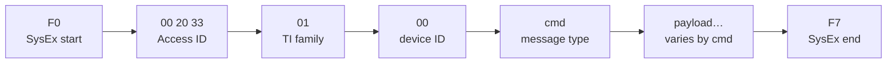

# Getting started

## Testing SysEx

The best way to understand SysEx commands is to test them using [sendmidi][]
and [receivemidi][]. You can install them on a Mac using [Homebrew][].

```bash
brew install sendmidi receivemidi
```

[Homebrew]: https://brew.sh/
[sendmidi]: https://github.com/gbevin/SendMIDI
[receivemidi]: https://github.com/gbevin/ReceiveMIDI

To communicate with your synth, you'll need to list the ports to identify which
one to send commands to.

```bash
sendmidi list
receivemidi list
```

Use the same port name for `sendmidi` and `receivemidi` (from the lists above).

Send SysEx with **`hex`** before **`syx`**, and **omit `F0`/`F7`** (sendmidi
adds them). Prefix data bytes with **`0x`** so values are not parsed as decimal
(e.g. `0x72` for cmd **`0x72`**, not `72` → `0x48`).

Request the edit-buffer Multi (Multi Dump):

```bash
sendmidi dev "<MIDI port>" hex syx \
  00 20 33 01 00 0x31 0x00 0x7f

receivemidi dev "<MIDI port>" dump
```

Access Virus SysEx is standard MIDI: one message per `F0 … F7` frame. The
docs use the same byte layout you see in a MIDI monitor or in `sendmidi hex
syx` (without the `F0`/`F7` wrappers — sendmidi adds those).

## One message, byte by byte



| Bytes       | Role                                                                |
| ----------- | ------------------------------------------------------------------- |
| `F0` / `F7` | SysEx start / end (omit when using `sendmidi hex syx`)              |
| `00 20 33`  | Access Music manufacturer ID                                        |
| `01`        | Family (TI series)                                                  |
| `00`        | Device ID (`00`–`0F` = unit 1–16; match your synth)                 |
| **`<cmd>`** | **What kind of message this is** (see below)                        |
| *rest*      | Depends on command: bank/slot, parameter bytes, or a full dump body |

Placeholders like `<part>`, `<param>`, and `<value>` are **one byte each** in
the real message (shown as hex). Example — change one live parameter:

```text
F0 00 20 33 01 00 72 <part> <param> <value> F7
```

`sendmidi` (no `F0`/`F7`):

```bash
sendmidi dev "<MIDI port>" hex syx 00 20 33 01 00 72 00 4A 00
#                                                 │  │  │  └── value (0 = Off)
#                                                 │  │  └─────── param 0x4A
#                                                 │  └──────────── part 0 = Part 1
#                                                 └──────────────── cmd 0x72
```

## What `cmd=0x71` (and similar) means

In the docs, **`cmd=0x71`** means: the **command byte** at that position in
the SysEx is **`71` hexadecimal** (decimal 113). It tells the synth how to
interpret the bytes that follow — **not** a MIDI note or a UI percentage by
itself.

Rough groups:

| Command byte                  | Typical role                                                | Example                                                                                      |
| ----------------------------- | ----------------------------------------------------------- | -------------------------------------------------------------------------------------------- |
| **`0x30`–`0x37`**             | **Requests** — ask the synth to **send** data back          | `0x30` = request one Single; `0x34` = request arrangement (Multi + 16 Singles)               |
| **`0x10`**, **`0x11`**        | **Dumps** — synth **replies** with a stored snapshot        | `0x10` = Single Dump (524 bytes on TI); `0x11` = Multi Dump (267 bytes)                      |
| **`0x70`–`0x73`**, **`0x6E`** | **Live edit** — change **one** parameter now (no full dump) | See [Paging](misc/virus.md#paging) (`0x70` Page A, `0x71` Page B, `0x72` Multi, …)           |

So **`cmd=0x71`** in [live-edit docs](../README.md#documentation) is a **live
parameter edit** on Page B (e.g. Smooth Mode `param 0x19`), not
“dump single” and not “dump arrangement”. **`cmd=0x10`** is the opposite
direction: a **full Single program** coming back from a request or save.

Request and dump commands: [bank.md](dumps/bank.md),
[multi.md](dumps/multi.md#request_multi-byte-table).

## What `0x23`-style values mean

**`0x` prefix = one byte written in hexadecimal** (0–255). On the wire,
MIDI SysEx data bytes are almost always **7-bit** (`00`–`7F` = 0–127).

The same notation is used for **different roles** — context tells you which:

| In docs                                | Meaning                                                         | Example                          |
| -------------------------------------- | --------------------------------------------------------------- | -------------------------------- |
| **`cmd=0x72`**                         | Command byte in the **message header**                          | Live Multi edit                  |
| **`param 0x4A`** / **`0x72` / `0x4A`** | **Parameter index** in a live-edit message                      | Hold Pedal enable                |
| **`<value> 00`**                       | **Parameter value** in a live-edit message                      | Off / 0% / minimum               |
| **`0x29`**, **`0x0D..0x16`**           | **Offset** inside a **dump** (byte index from start of `F0`)    | “Part bank lives at byte `0x29`” |
| **`bank 01`**, **`slot 40`**           | **Address** bytes in requests/dump headers (which program slot) | RAM A program 0 → `01` `00`      |

**Offsets** (`0x29`, `0x209`, …) are **positions in the 524- or 267-byte
dump file**, not separate MIDI messages. **Live-edit** lines like
`71 00 19 00` are **not** offsets — they are **param** and **value** bytes
right after `cmd` and `part`.

Some parameters use **encoded** values (not “what you see on the LCD”):

- Direct **`0`–`127`** (e.g. Reverb Send)
- **Bipolar**: `stored = ui + 64` (UI −64 → byte `00`)
- **Tempo**: `stored = bpm − 63`

The parameter map tables mark **Live edit** as command + param (e.g.
`71` / `0x19`) and **Dump offset** as a hex position when known.

## Requests vs dumps vs live edits

```text
# Request: “send me the edit-buffer Multi” (you receive Multi Dump 0x11)
F0 00 20 33 01 00 31 00 7f F7

# Request: “send arrangement” → Multi Dump + 16 × Single Dump
F0 00 20 33 01 00 34 00 F7

# Reply fragment: start of a Single dump (cmd 0x10, bank 00, slot = part 1)
F0 00 20 33 01 00 10 00 00 … F7

# Live edit: set one parameter (no full program transfer)
F0 00 20 33 01 00 71 00 19 00 F7
```

**Single mode “load program”:** there is no short SysEx “load bank/slot by
reference” — use **MIDI Program Change**, or **`0x30` + full `0x10` upload**
for editor/backup workflows. See
[bank.md — Single mode program recall](dumps/bank.md#no--load-program-by-slot--sysex-in-single-mode).
