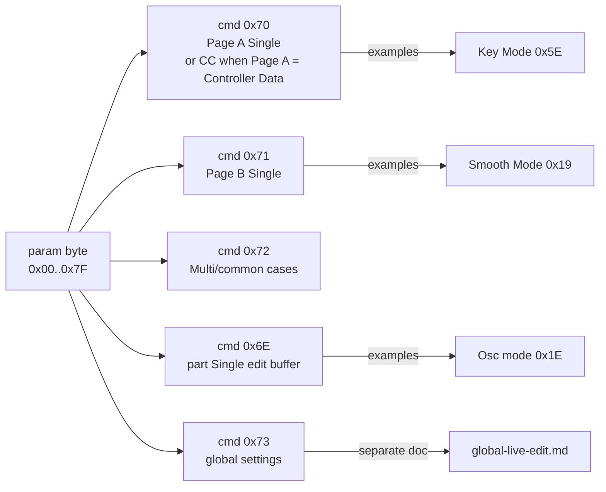

# Single Live Edit

[Docs index](README.md) · [Root README](../README.md)

Single-related SysEx notes for Virus TI mk2.

Full control inventory and **`cmd` / param** worksheet:
[single-dump.md — Single parameter map](single-dump.md#single-parameter-map)
(415 Single-program controls; Multi parameters →
[multis-dump.md — Multi parameter map](multis-dump.md#multi-parameter-map)).

```text
F0 00 20 33 01 00 72 <part> <param> <value> F7   # multi / common (some params)
F0 00 20 33 01 00 71 <part> <param> <value> F7   # Page B single (some params)
F0 00 20 33 01 00 70 <part> <param> <value> F7   # Page A single (when global Page A = SysEx)
F0 00 20 33 01 00 6E <part> <param> <value> F7   # part single edit buffer
```

Param IDs are **not global** — the same hex ID can mean different settings
under different `cmd` bytes (e.g. **`0x73` / `0x19`** = All EQs global,
**`0x71` / `0x19`** = Smooth Mode).



## Common (Edit Single)

Per-part **Common** page settings (Edit Single). Not stored in
**`DUMP_MULTI`** (hardware-tested for Bend Up/Down — see
[multis-live-edit.md](multis-live-edit.md)).

### Patch Transpose (CC 93)

Edit Single → Common → **Patch Transpose**. **CC 93** only on live edit
(`stored = ui + 64`; **+1** → CC **65**). See
[control-change.md — Patch Transpose](control-change.md#patch-transpose-cc-93).

### Key Mode (`0x5E`, `cmd=0x70` / CC 94)

**Key Mode** (Page A param **94** / `0x5E`). Virus panel: **Oscillators** →
**EDIT** → Common → **Key Mode**; also a **MONO** shortcut on the
oscillator section (see below).

| Value | Mode   | CC 94 | SysEx (`Page A` = SysEx) |
| ----- | ------ | ----- | ------------------------ |
| `00`  | Poly   | `0`   | `F0 … 70 40 5E 00 F7`    |
| `01`  | Mono 1 | `1`   | `F0 … 70 40 5E 01 F7`    |
| `02`  | Mono 2 | `2`   | `F0 … 70 40 5E 02 F7`    |
| `03`  | Mono 3 | `3`   | `F0 … 70 40 5E 03 F7`    |
| `04`  | Mono 4 | `4`   | `F0 … 70 40 5E 04 F7`    |
| `05`  | Hold   | `5`   | `F0 … 70 40 5E 05 F7`    |

Scope byte **`0x40`** on hardware TX (verify). Global **MIDI Controller Page A**
= **Controller Data** → **CC 94** on the part channel instead; **SysEx** →
**`cmd=0x70`** as above. See [control-change.md — Key Mode](control-change.md#key-mode-cc-94).

**MONO button (hardware shortcut)**

| Action       | Messages                                                    |
| ------------ | ----------------------------------------------------------- |
| MONO **on**  | `F0 … 70 40 5E 02 F7` only → **Mono 2** (not Mono 1)        |
| MONO **off** | `F0 … 6E 40 7A 02 F7` then `F0 … 70 40 5E 00 F7` → **Poly** |

MONO **off** also sends **`F0 … 6E … 7A 02 F7`** before Key Mode Poly. Param
**`0x7A`** on **`cmd=0x6E`** is **Pan Spread** (Filters → Common) when
**Routing** = **Split Mode** — see Filter Common notes in
[testing.md](testing.md#confirmation-queue-waf80--ti). The **`02`** on MONO off
may be unrelated; re-verify if routing is not Split.

### Smooth Mode (`0x19`, `cmd=0x71`)

Arpeggiator / note **Smooth Mode** (Edit Single → Common).

| Value | Mode          | Confirmed                                                                 |
| ----- | ------------- | ------------------------------------------------------------------------- |
| `00`  | Off           | ✓ (hardware); some hosts cannot send Off — [aura-notes.md](aura-notes.md) |
| `01`  | On            | ✓                                                                         |
| `02`  | Auto          | ✓                                                                         |
| `03`  | Note          | ✓                                                                         |
| `04`  | Quantise 1/64 | ✓                                                                         |
| `05`  | Quantise 1/32 | ✓                                                                         |
| `06`  | Quantise 1/16 | inferred                                                                  |
| `07`  | Quantise 1/8  | inferred                                                                  |
| `08`  | Quantise 1/4  | inferred                                                                  |
| `09`  | Quantise 1/2  | ✓                                                                         |
| `0A`  | Quantise 3/64 | ✓                                                                         |
| `0B`  | Quantise 3/32 | inferred                                                                  |
| `0C`  | Quantise 3/16 | inferred                                                                  |
| `0D`  | Quantise 3/8  | inferred                                                                  |
| `0E`  | Quantise 1/24 | inferred                                                                  |
| `0F`  | Quantise 1/12 | inferred                                                                  |
| `10`  | Quantise 1/6  | inferred                                                                  |
| `11`  | Quantise 1/3  | inferred                                                                  |
| `12`  | Quantise 2/3  | inferred                                                                  |
| `13`  | Quantise 3/4  | inferred                                                                  |
| `14`  | Quantise 1/1  | inferred                                                                  |

```text
F0 00 20 33 01 00 71 00 19 00 F7   # Off
F0 00 20 33 01 00 71 00 19 01 F7   # On
F0 00 20 33 01 00 71 00 19 02 F7   # Auto
F0 00 20 33 01 00 71 00 19 03 F7   # Note
F0 00 20 33 01 00 71 00 19 04 F7   # Quantise 1/64
F0 00 20 33 01 00 71 00 19 05 F7   # Quantise 1/32
F0 00 20 33 01 00 71 00 19 09 F7   # Quantise 1/2
F0 00 20 33 01 00 71 00 19 0A F7   # Quantise 3/64
```

### Bender Scale (`0x1C` / `0x1D`)

**Pitch bender curve** (Edit Single → Common → Bender Scale).

| Mode        | Message               | Confirmed |
| ----------- | --------------------- | --------- |
| Linear      | `F0 … 72 00 1D 00 F7` | ✓         |
| Exponential | `F0 … 71 00 1C 01 F7` | ✓         |

Uses **mixed commands** (`0x72` for Linear / param **`0x1D`**, `0x71` for
Exponential / param **`0x1C`**). Re-verify Exponential on hardware if a
single param ID is expected.

### Bend Up / Bend Down (`0x1A` / `0x1B`, `cmd=0x71`)

Pitch bend **range** limits — documented in
[multis-live-edit.md — Bend Up / Bend Down](multis-live-edit.md#bend-up-0x1a-cmd0x71).
Same Edit Single **Common** context; not in **`DUMP_MULTI`**.

### Patch Volume (CC 91)

**Edit Single → Common → Patch Volume** — **MIDI CC 91 only** (no SysEx).
See [control-change.md — Patch Volume](control-change.md#patch-volume-cc-91).
Distinct from Multi **Part Level** (`0x99 + part` / live `0x27`).

## Oscillators

**LCD:** **OSCILLATORS** → **Oscillator 1** / **2** / **Common** / **Mixer**.

Parameters are a **nested tree**: **Mode** → (for Classic) **Shape** →
controls on sub-menus **1–2** (Classic), **1–3** (Wavetable, Grain Simple,
Formant Simple), or **1–4** (Grain Complex, Formant Complex). Document only
rows that appear on the panel for the active Mode/Shape.

Capture path: **`Mode` / `Shape` / `Control` → LCD value**. Use **+/−** when
possible. Knob sweeps: use the **last** SysEx line. Master inventory:
[single-dump.md — Oscillators](single-dump.md#oscillators).

### LCD “landing zones” (same label, different wire)

On many TI controls the **panel shows one LCD value on several consecutive
detents** while the **SysEx byte still steps +1** each time (`00`–`7F` on the
wire). That does **not** feel like the knob is “stuck” — turn rate still feels
normal — because **display updates and wire resolution are decoupled**: the
firmware keeps fine internal steps for sound and automation, but only changes
the readout when the value crosses the next **0.1**-style label (or a named
tick like **Norm**). While the LCD holds **1.7**, the engine may still walk
**`15` → `16` → `17`** without you noticing each hex step.

This is **usability engineering** for physical knobs (high sensitivity, limited
precision): wide **landing zones** for values humans often want (**+0**, **Norm**,
round percents) without tedious micro-adjustment, while the backend still uses
the full **128**-step range.

Examples from this repo:

| Control                   | Landing users care about | Wire (examples)                                   |
| ------------------------- | ------------------------ | ------------------------------------------------- |
| Semitone                  | **+0**                   | **`40`** (not the only byte, but a stable center) |
| Key Follow                | **Norm (+32)**           | **`60`** (between **`5F`** / **`61`**)            |
| Balance                   | **0 %**                  | **`40`**                                          |
| Hypersaw Density          | round **1.x–8.x**        | e.g. **`15`/`16`** → 1.7, **`3F`/`40`** → 3.0     |
| Classic Shape (Saw>Pulse) | sparse **%**             | many **+1/+2** LCD steps                          |

**Implication for tools:** map **wire → LCD** with a full detent table (or capture),
not `stored = f(lcd)` from one formula alone. For **automation**, send the **wire**
byte; for **UI display**, use the table or accept that several wires show the same
string.

### Oscillator 1 — Mode

| LCD (Mode)      | `cmd` | `param` | `<value>` | Confirmed |
| --------------- | ----- | ------- | --------- | --------- |
| Classic         | `6E`  | `1E`    | `00`      | ✓         |
| Hypersaw        | `6E`  | `1E`    | `01`      | ✓         |
| Wavetable       | `6E`  | `1E`    | `02`      | ✓         |
| Wavetable PWM   | `6E`  | `1E`    |           |           |
| Grain Simple    | `6E`  | `1E`    |           |           |
| Grain Complex   | `6E`  | `1E`    |           |           |
| Formant Simple  | `6E`  | `1E`    |           |           |
| Formant Complex | `6E`  | `1E`    |           |           |

Modes **`02`–`07`** — fill LCD labels when stepped with **+/−**. Param **`0x1E`**
on **`0x6E`** only (not **`0x71`** Filter 1 env polarity).

```text
F0 00 20 33 01 00 6E 00 1E 00 F7   # Mode Classic
F0 00 20 33 01 00 6E 00 1E 01 F7   # Mode Hypersaw
F0 00 20 33 01 00 6E 00 1E 02 F7   # Mode Wavetable
```

### Oscillator 1 — Classic

**Mode `<value>` = `00`**. **Shape** / **Wave Select** / **Pulse Width** — see below.

**Sub-menus:** **1–2** (LCD pages).

#### Shape (`0x11`) — wave / saw blend + pure saw

**`70` / `11`**. Classic **Shape** is three regions on one control:

| Region               | `<value>` | LCD (examples)                                            |
| -------------------- | --------- | --------------------------------------------------------- |
| Pure **Wave Select** | `00`      | Spectral Wave                                             |
| **Wave / saw mix**   | `01`–`3F` | Wave>Saw 1 % … Wave>Saw 98 %                              |
| Pure **saw**         | `40`      | Sawtooth                                                  |
| **Saw / pulse mix**  | `41`–`7E` | Saw>Pulse … _(LCD % skips integers; **`41`–`7F`** table)_ |
| Pure **pulse**       | `7F`      | Pulse                                                     |

**Wave>Saw 98 %** (`3F`) = top of **wave/saw** mix only.
**`40`–`41`+** add **saw** then **saw/pulse** blend. **Pulse Width** (`12`,
WAF80) appears on the panel when **Shape ≥ `40`** (Sawtooth and Saw>Pulse —
not at Spectral Wave `00`). **Pulse Width** **`70`/`12`** formulas are in
[Pulse Width](#pulse-width-shape--sawtooth); LCD lookup table is in
[parameter-option-lists.md](parameter-option-lists.md#osc-1-classic--pulse-width-lcd).

| LCD                | `<value>` | Confirmed |
| ------------------ | --------- | --------- |
| Sawtooth           | `40`      | ✓         |
| Saw>Pulse 2 %      | `41`      | ✓         |
| Saw>Pulse 3 %      | `42`      | ✓         |
| Saw>Pulse 5 %      | `43`      | ✓         |
| Saw>Pulse 6 %      | `44`      | ✓         |
| Saw>Pulse 2 %…98 % | `41`–`7E` | ✓ (table) |
| Pulse              | `7F`      | ✓         |

**Saw/Pulse mix** uses **hex** bytes **`0x44`–`0x7E`** (+1 per **+/−**).
Easy mistake: the log’s trailing **`dec`** is the **decimal equivalent** of
that hex byte (`0x44` → 68 dec, `0x5A` → 90 dec) — not a separate index. A
label list keyed as decimal **44–66** was wrong; the wire run was
**hex `44`–`5A`** for this sweep.

**Read the log:**

```text
… 70 00 11 5A dec
           ^^      ← document **0x5A** (not decimal 90, not “66”)
```

**Hex `0x41`–`0x7F`** (Osc 1 Classic Shape, full saw/pulse sweep):

| `<value>` (hex) | LCD label      |
| --------------- | -------------- |
| `41`            | Saw>Pulse 2 %  |
| `42`            | Saw>Pulse 3 %  |
| `43`            | Saw>Pulse 5 %  |
| `44`            | Saw>Pulse 6 %  |
| `45`            | Saw>Pulse 8 %  |
| `46`            | Saw>Pulse 10 % |
| `47`            | Saw>Pulse 11 % |
| `48`            | Saw>Pulse 13 % |
| `49`            | Saw>Pulse 14 % |
| `4A`            | Saw>Pulse 16 % |
| `4B`            | Saw>Pulse 17 % |
| `4C`            | Saw>Pulse 19 % |
| `4D`            | Saw>Pulse 21 % |
| `4E`            | Saw>Pulse 22 % |
| `4F`            | Saw>Pulse 24 % |
| `50`            | Saw>Pulse 25 % |
| `51`            | Saw>Pulse 27 % |
| `52`            | Saw>Pulse 29 % |
| `53`            | Saw>Pulse 30 % |
| `54`            | Saw>Pulse 32 % |
| `55`            | Saw>Pulse 33 % |
| `56`            | Saw>Pulse 35 % |
| `57`            | Saw>Pulse 37 % |
| `58`            | Saw>Pulse 38 % |
| `59`            | Saw>Pulse 40 % |
| `5A`            | Saw>Pulse 41 % |
| `5B`            | Saw>Pulse 43 % |
| `5C`            | Saw>Pulse 44 % |
| `5D`            | Saw>Pulse 46 % |
| `5E`            | Saw>Pulse 48 % |
| `5F`            | Saw>Pulse 49 % |
| `60`            | Saw>Pulse 51 % |
| `61`            | Saw>Pulse 52 % |
| `62`            | Saw>Pulse 54 % |
| `63`            | Saw>Pulse 56 % |
| `64`            | Saw>Pulse 57 % |
| `65`            | Saw>Pulse 59 % |
| `66`            | Saw>Pulse 60 % |
| `67`            | Saw>Pulse 62 % |
| `68`            | Saw>Pulse 63 % |
| `69`            | Saw>Pulse 65 % |
| `6A`            | Saw>Pulse 67 % |
| `6B`            | Saw>Pulse 68 % |
| `6C`            | Saw>Pulse 70 % |
| `6D`            | Saw>Pulse 71 % |
| `6E`            | Saw>Pulse 73 % |
| `6F`            | Saw>Pulse 75 % |
| `70`            | Saw>Pulse 76 % |
| `71`            | Saw>Pulse 78 % |
| `72`            | Saw>Pulse 79 % |
| `73`            | Saw>Pulse 81 % |
| `74`            | Saw>Pulse 83 % |
| `75`            | Saw>Pulse 84 % |
| `76`            | Saw>Pulse 86 % |
| `77`            | Saw>Pulse 87 % |
| `78`            | Saw>Pulse 89 % |
| `79`            | Saw>Pulse 90 % |
| `7A`            | Saw>Pulse 92 % |
| `7B`            | Saw>Pulse 94 % |
| `7C`            | Saw>Pulse 95 % |
| `7D`            | Saw>Pulse 97 % |
| `7E`            | Saw>Pulse 98 % |
| `7F`            | Pulse          |

All rows are **`cmd=0x70` `param=0x11` (Shape)** on Osc 1 Classic. **+1**
hex per **+/−** from **`41`** through **`7E`** (61 steps, LCD **2 %→98 %**),
then **`7F`** = pure Pulse.
Stray **`70 00 25`** during sweeps = **Noise Volume** (accidental knob).

#### LCD % vs wire

Each detent is one byte; the LCD **integer** skips values (7 %, 9 %, …)
because the display steps **+1 or +2** per **+/−** only. **`41`→`7E`**:
**26×+1** and **35×+2** (96 points over 61 steps). No reliable one-line
formula — use the table. Example:
**`71`→`7E`**: **`+1 +2 +2 +1 +2 +1 +2 +1 +2 +2 +1 +2 +1`**.

**Wave Select** (`13`) applies in the **`00` / `01`–`3F`** regions. Controls below
were captured at **Shape = `00`**.

#### Controls at Shape = Spectral Wave (`00`)

| Control     | `cmd` | `param` | Encoding / notes                                                          | Confirmed |
| ----------- | ----- | ------- | ------------------------------------------------------------------------- | --------- |
| Shape       | `70`  | `11`    | Mix; `00` = pure wave                                                     | ✓         |
| Wave Select | `70`  | `13`    | **`00`–`3F`**: Sine, Triangle, Wave 3…Wave 64                             | ✓         |
| Pulsewidth  | —     | —       | Panel hidden at **`00`**; see [Pulse Width](#pulse-width-shape--sawtooth) | —         |
| Semitone    | `70`  | `14`    | **−48..+48** → `stored = ui + 64`                                         | ✓         |
| Key Follow  | `70`  | `15`    | **−64..+63** → `stored = ui + 64`                                         | ✓         |
| Balance     | `70`  | `21`    | **−100..+100 %** → see [Balance](#balance-osc-1-classic)                  | ✓         |

**Menu 1** — **Norm** on Key Follow is a fixed **+32** (`60`) scale tick,
not per-patch default (store test: saved **−21** → `2B`, reload — **Norm**
still **+32**). **Menu 2** — report if any controls remain.

**Semitone** (`14`): **−48..+48** → `stored = semitone + 64` (**`10`..`70`**).

```text
F0 00 20 33 01 00 70 00 14 10 F7   # Semitone −48
F0 00 20 33 01 00 70 00 14 40 F7   # Semitone +0
F0 00 20 33 01 00 70 00 14 70 F7   # Semitone +48
```

**Key Follow** (`15`): **−64..+63** → `stored = ui + 64`
(**`00`..`7F`**). Panel **Norm** = **+32** → **`60`** (fixed scale tick,
not per-patch default).

```text
F0 00 20 33 01 00 70 00 15 00 F7   # Key Follow −64
F0 00 20 33 01 00 70 00 15 40 F7   # Key Follow 0
F0 00 20 33 01 00 70 00 15 60 F7   # Key Follow Norm (+32)
F0 00 20 33 01 00 70 00 15 7F F7   # Key Follow +63
```

#### Balance (Osc 1 Classic)

**`cmd=0x70` `param=0x21`** — **−100.0 %..+100.0 %** (not Filter Balance **`0x30`**).

```text
stored = round((pct + 100) × 127 / 200)
pct    = stored × 200 / 127 − 100
```

```text
F0 00 20 33 01 00 70 00 21 00 F7   # Balance −100.0 %
F0 00 20 33 01 00 70 00 21 40 F7   # Balance +0 %
F0 00 20 33 01 00 70 00 21 7F F7   # Balance +100.0 %
```

#### Controls at Shape ≥ Sawtooth (`40`)

**Pulse Width** on the panel when **Shape ≥ `40`** (Sawtooth / Saw>Pulse / Pulse).

#### Pulse Width (Shape ≥ Sawtooth)

| Control     | `cmd` | `param` | Confirmed |
| ----------- | ----- | ------- | --------- |
| Pulse Width | `70`  | `12`    | ✓         |

**Wire** (`stored` = **`00`–`7F`**, +1 per detent):

```text
pct = 50 + stored × 50 / 127
stored = round((pct − 50) × 127 / 50)    # clamp 00..7F
```

**LCD** (panel readout, **Shape ≥ `40`**):
`lcd = round(pct + 0.4, 0.1)` — endpoints **`00`** / **`7F`** show
**50.0 %** / **100 %** on the wire values directly. Same label can appear
on two detents. Partial **wire → LCD** map:
[parameter-option-lists.md — Osc 1 Pulse Width LCD](parameter-option-lists.md#osc-1-classic--pulse-width-lcd).

```text
F0 00 20 33 01 00 70 00 12 00 F7   # min 50.0 %
F0 00 20 33 01 00 70 00 12 7F F7   # max 100 %
```

### Oscillator 1 — Hypersaw

**Mode `<value>` = `01`**. No **Shape** / **Wave Select** (Classic-only).
**Sub-menus:** **1–2**. Page A **`0x11`** = **Density** here (Classic uses
the same index for **Shape**).

| Control        | `cmd` | `param` | Encoding                                          | Confirmed |
| -------------- | ----- | ------- | ------------------------------------------------- | --------- |
| Density        | `70`  | `11`    | **1.0..9.0** — see below                          | ✓         |
| Local Detune   | `70`  | `12`    | **0..127** → `stored = lcd`                       | ✓         |
| Sync           | `70`  | `1C`    | Off **`00`** / On **`01`**                        | ✓         |
| Sync Frequency | `70`  | `1B`    | **0..127** when **Sync On**; `stored = lcd`       | ✓         |
| Semitone       | `70`  | `14`    | Same as [Classic](#oscillator-1--classic)         | ✓         |
| Key Follow     | `70`  | `15`    | Same as Classic                                   | ✓         |
| Balance        | `70`  | `21`    | Same as [Classic Balance](#balance-osc-1-classic) | ✓         |

**Density** (`11` in Hypersaw only): **1.0..9.0**, +1 wire per detent
**`00`–`7F`**.

```text
internal = 1 + stored × 8 / 127          # SysEx / engine (00 → 1.0, 7F → 9.0)
scale    = stored / 127
lcd      ≈ round(1 + (internal − 1) × scale, 0.1)
```

**LCD formula status:** `lcd ≈ round(1 + (internal − 1) × scale, 0.1)`
lands **`40`**, **`74`–`76`**, **`7B`**, **`7F`**; **`58`–`6C`** often
**~0.1–0.5 below** prediction; **`44`–`57`**, **`74`+** within **~0.1**.
Duplicate labels appear on some detents (**`5C`/`5D`**, **`67`/`68`**,
**`77`/`78`**, etc.). Full **128**-entry map:
[parameter-option-lists.md — Density LCD](parameter-option-lists.md#osc-1-hypersaw--density-lcd).

**Do not** use `stored = round((lcd − 1) × 127 / 8)` from LCD alone
(e.g. LCD **3.0** → **`3F`**, not **`20`**).

```text
F0 00 20 33 01 00 70 00 11 00 F7   # Density 1.0
F0 00 20 33 01 00 70 00 11 3F F7   # Density 3.0 (LCD)
F0 00 20 33 01 00 70 00 11 7F F7   # Density 9.0
```

**Local Detune** (`12` in Hypersaw only): same Page A index as Classic
**Pulse Width** (**`12`** there is **50.0 %** … **100 %**). Only interpret
**`12`** with **Mode `01`**.

Panel **0..127** (unsigned, not bipolar). **Wire = LCD** (one detent per
step **`00`–`7F`**).

```text
stored = lcd    # 0..127
lcd    = stored
```

| LCD | `<value>` | Confirmed |
| --- | --------- | --------- |
| 0   | `00`      | ✓         |
| 80  | `50`      | ✓         |

```text
F0 00 20 33 01 00 70 00 12 00 F7   # Local Detune 0
F0 00 20 33 01 00 70 00 12 50 F7   # Local Detune 80
F0 00 20 33 01 00 70 00 12 7F F7   # Local Detune 127 (max wire)
```

**Sync** (`1C` in Hypersaw): panel **Off** / **On**. WAF80 CC **28** lists
**Osc2 Sync** **0/1** — same wire pattern on Osc 1 here.

| LCD | `<value>` | Confirmed |
| --- | --------- | --------- |
| Off | `00`      | ✓         |
| On  | `01`      | ✓         |

```text
F0 00 20 33 01 00 70 00 1C 00 F7   # Sync Off
F0 00 20 33 01 00 70 00 1C 01 F7   # Sync On
```

**Sync Frequency** (`1B`, conditional on **Sync On**): dump
**Oscillator 1+2 X-Sync Frequency**. Hidden when **Sync Off**.
Panel **0..127** — **`stored = lcd`** (same as **Local Detune**).

| LCD | `<value>` | Confirmed |
| --- | --------- | --------- |
| 0   | `00`      | ✓         |
| 64  | `40`      | ✓         |
| 127 | `7F`      | ✓         |

```text
F0 00 20 33 01 00 70 00 1B 00 F7   # Sync Frequency 0
F0 00 20 33 01 00 70 00 1B 40 F7   # Sync Frequency 64
F0 00 20 33 01 00 70 00 1B 7F F7   # Sync Frequency 127
```

**Semitone**, **Key Follow**, **Balance** — same **`14` / `15` / `21`** and
encodings as Classic (verified in **Mode `01`** sweeps: Semitone
**`10`..`70`** → **−48..+48**, Key Follow **`00`..`7F`** → **−64..+63**,
Balance **`00`/`40`/`7F`** → **−100 % / 0 % / +100 %**).

### Oscillator 1 — Wavetable

**Mode `<value>` = `02`**. **Sub-menus:** **1–3**. Panel: **Index**,
**Wavetable**, **Interpolation**, **Semitone**, **Key Follow**, **Balance**
(no Classic **Shape** / Hypersaw **Density** / **Sync**).

| Control       | `cmd` | `param` | Encoding                                  | Confirmed |
| ------------- | ----- | ------- | ----------------------------------------- | --------- |
| Index         | `70`  | `11`    | **0..127** → `stored = lcd`               | ✓         |
| Wavetable     | `70`  | `13`    | Enum **`00`–`63`** (100 names); see below | ✓         |
| Interpolation |       |         |                                           |           |
| Semitone      | `70`  | `14`    | Same as Classic (assumed)                 | —         |
| Key Follow    | `70`  | `15`    | Same as Classic (assumed)                 | —         |
| Balance       | `70`  | `21`    | Same as Classic (assumed)                 | —         |

**Index** (`11` in Wavetable only): same Page A index as Classic **Shape** / Hypersaw
**Density**. **`stored = lcd`** (**`00`–`7F`**).

| LCD | `<value>` | Confirmed |
| --- | --------- | --------- |
| 0   | `00`      | ✓         |
| 127 | `7F`      | ✓         |

```text
F0 00 20 33 01 00 70 00 11 00 F7   # Index 0
F0 00 20 33 01 00 70 00 11 7F F7   # Index 127
```

Stepped **`00`→`38`** (+1 per detent) then fast sweep to **`7F`** — no
anomalies vs **1:1** encoding.

**Wavetable** (`13` in Wavetable mode): same Page A index as Classic
**Wave Select**. **`stored`** = wavetable index (**0**–**99** →
**`00`–`63`**). Panel order matches
[parameter-option-lists.md — Wavetable Names](parameter-option-lists.md#wavetable-names)
(hardware verified: full sweep **Sine** → **Domina7rix**).

| LCD             | `<value>` | Confirmed |
| --------------- | --------- | --------- |
| Sine (0)        | `00`      | ✓         |
| Domina7rix (99) | `63`      | ✓         |

```text
F0 00 20 33 01 00 70 00 13 00 F7   # Wavetable index 0 (Sine)
F0 00 20 33 01 00 70 00 13 63 F7   # Wavetable index 99 (Domina7rix)
```

### Oscillator 1 — Wavetable PWM

Panel label **Wave PWM**. **Sub-menus:** **1–3**. Same as Wavetable plus:

| Control      | `cmd` | `param` | Encoding | Confirmed |
| ------------ | ----- | ------- | -------- | --------- |
| Pulse Width  |       |         |          |           |
| Local Detune |       |         |          |           |

_(Index, Wavetable, Interpolation, Semitone, Key Follow, Balance — see
Wavetable table.)_

### Oscillator 1 — Grain Simple

**Sub-menus:** **1–3**.

| Control       | `cmd` | `param` | Encoding | Confirmed |
| ------------- | ----- | ------- | -------- | --------- |
| Index         |       |         |          |           |
| Wavetable     |       |         | enum     |           |
| F-Shift       |       |         |          |           |
| Interpolation |       |         |          |           |
| Semitone      |       |         |          |           |
| Key Follow    |       |         |          |           |
| Balance       |       |         |          |           |

### Oscillator 1 — Grain Complex

**Sub-menus:** **1–4**.

| Control       | `cmd` | `param` | Encoding | Confirmed |
| ------------- | ----- | ------- | -------- | --------- |
| Index         |       |         |          |           |
| Wavetable     |       |         | enum     |           |
| F-Shift       |       |         |          |           |
| F-Spread      |       |         |          |           |
| Local Detune  |       |         |          |           |
| Interpolation |       |         |          |           |
| Semitone      |       |         |          |           |
| Key Follow    |       |         |          |           |
| Balance       |       |         |          |           |

### Oscillator 1 — Formant Simple

**Sub-menus:** **1–3**.

| Control    | `cmd` | `param` | Encoding | Confirmed |
| ---------- | ----- | ------- | -------- | --------- |
| Index      |       |         |          |           |
| Wavetable  |       |         | enum     |           |
| Semitone   |       |         |          |           |
| Key Follow |       |         |          |           |
| Balance    |       |         |          |           |

### Oscillator 1 — Formant Complex

**Sub-menus:** **1–4**.

| Control       | `cmd` | `param` | Encoding | Confirmed |
| ------------- | ----- | ------- | -------- | --------- |
| Index         |       |         |          |           |
| Wavetable     |       |         | enum     |           |
| F-Shift       |       |         |          |           |
| F-Spread      |       |         |          |           |
| Local Detune  |       |         |          |           |
| Interpolation |       |         |          |           |
| Semitone      |       |         |          |           |
| Key Follow    |       |         |          |           |
| Balance       |       |         |          |           |

### Oscillator 2

_(Same Mode / Shape / table pattern — not started.)_

### Mixer (Oscillators menu)

### Oscillator Section Volume (`cmd=0x71`, param `0x7F`)

**Oscillators → Mixer → Oscillator Section Volume** (main osc mixer level).
Same bipolar range as [Saturation — Osc Volume](#saturation--osc-volume-cmd0x70-param-0x24)
but edited via **Page B** SysEx here, not **`70` / `24`**.

| Item                    | Value                                           |
| ----------------------- | ----------------------------------------------- |
| Message (last in burst) | `F0 00 20 33 01 00 71 40 7F 00 F7`              |
| Scope byte              | `0x40` (verify — expected `0x00` for Part 1)    |
| Param ID                | `0x7F`                                          |
| Value encoding          | Bipolar **`stored = ui + 64`** (`−64` → `0x00`) |
| Confirmed               | Hardware TX, landing **−64** → `0x00`           |

```text
F0 00 20 33 01 00 71 40 7F 00 F7   # Oscillator Section Volume −64
```

### Sub Oscillator Volume (CC 34)

**Oscillators → Mixer → Sub Oscillator Volume**. Live edit is **CC 34 only**
(no SysEx); may still appear in **`DUMP_SINGLE`**. See
[control-change.md — Sub Oscillator Volume](control-change.md#sub-oscillator-volume-cc-34).

## Filters

**LCD:** **FILTERS** → **Filter 1** / **Filter 2** / **Common** / **Filter 1
envelope**. Filter 1, Filter 2, **Common**, and **Filter 1 ADSR** confirmed on
TI mk2 desktop; remaining **FILTERS** rows (e.g. Env 3/4, modulation) — see
[testing.md — Filters queue](testing.md#filters--order-filter-1-first).

### Filter 1 Cutoff (`cmd=0x70`, param `0x28`)

**FILTERS → EDIT → Filter 1 → Cutoff**. WAF80 Page **A** index **40** =
**`0x28`**.

| Item           | Value                                                    |
| -------------- | -------------------------------------------------------- |
| Message format | `F0 00 20 33 01 00 70 <part> 28 <value> F7`              |
| Scope (Part 1) | **`0x00`**                                               |
| Value encoding | Direct **`0`–`127`** (UI **0** → `00`; sweep max → `7F`) |
| Confirmed      | Hardware TX, Page A/B = **SysEx**                        |

```text
F0 00 20 33 01 00 70 00 28 00 F7   # Cutoff 0 (landing)
F0 00 20 33 01 00 70 00 28 7F F7   # Cutoff max (127 on wire)
```

LCD may show **128** at the top of the range; highest byte on the wire is
**`0x7F`**.

### Filter 1 Resonance (`cmd=0x70`, param `0x2A`)

**FILTERS → EDIT → Filter 1 → Resonance**. WAF80 Page **A** index **42** =
**`0x2A`**.

| Item           | Value                                       |
| -------------- | ------------------------------------------- |
| Message format | `F0 00 20 33 01 00 70 <part> 2A <value> F7` |
| Scope (Part 1) | **`0x00`**                                  |
| Value encoding | Direct **`0`–`127`** (UI **127** → `7F`)    |
| Confirmed      | Hardware TX                                 |

```text
F0 00 20 33 01 00 70 00 2A 7F F7   # Resonance 127 (landing)
```

### Filter 1 Mode (`cmd=0x70`, param `0x33`)

**FILTERS → EDIT → Filter 1 → Mode** (or **Filter 1 Mode**). WAF80 Page **A**
index **51** = **`0x33`**. Classic 1999: **0** LP, **1** HP, **2** BP, **3** BS.
TI mk2 adds more modes — capture **every** LCD label until the list repeats.

| UI (reported) | `<value>` | Confirmed |
| ------------- | --------- | --------- |
| Low Pass      | `00`      | ✓         |
| High Pass     | `01`      | ✓         |
| Band Pass     | `02`      | ✓         |
| Band Stop     | `03`      | ✓         |
| Analog 1 Pole | `04`      | ✓         |
| Analog 2 Pole | `05`      | ✓         |
| Analog 3 Pole | `06`      | ✓         |
| Analog 4 Pole | `07`      | ✓         |

**TI mk2 desktop (INIT, Filter 1):** **8** modes, **`00`–`07`** sequential. No further
options after Analog 4 Pole on hardware tested. **Filter 2 Mode** (`0x34`) has only
**four** modes (LP/HP/BP/BS) — see below. There is **no** separate **Analog Mode**
on/off — analog filtering is selected via Filter 1 mode names (not a VC/CSV
toggle).

```text
F0 00 20 33 01 00 70 00 33 00 F7   # Low Pass
F0 00 20 33 01 00 70 00 33 01 F7   # High Pass
F0 00 20 33 01 00 70 00 33 02 F7   # Band Pass
F0 00 20 33 01 00 70 00 33 03 F7   # Band Stop
F0 00 20 33 01 00 70 00 33 04 F7   # Analog 1 Pole
F0 00 20 33 01 00 70 00 33 05 F7   # Analog 2 Pole
F0 00 20 33 01 00 70 00 33 06 F7   # Analog 3 Pole
F0 00 20 33 01 00 70 00 33 07 F7   # Analog 4 Pole
```

### Filter 1 Envelope Amount (`cmd=0x70`, param `0x2C`)

**FILTERS → EDIT → Filter 1 → Envelope Amount** (WAF80: Filter1 Env Amt). Page **A**
index **44** = **`0x2C`**.

| Item           | Value                                                     |
| -------------- | --------------------------------------------------------- |
| Message format | `F0 00 20 33 01 00 70 <part> 2C <value> F7`               |
| Scope (Part 1) | **`0x00`**                                                |
| Value encoding | **Linear percent:** `stored = round(percent × 127 / 100)` |
| Confirmed      | Hardware TX                                               |

| LCD (reported) | `<value>` | Confirmed |
| -------------- | --------- | --------- |
| 0.0 %          | `00`      | ✓         |
| 50.0 %         | `40`      | ✓         |
| 100.0 %        | `7F`      | ✓         |

```text
F0 00 20 33 01 00 70 00 2C 00 F7   # 0.0 %
F0 00 20 33 01 00 70 00 2C 40 F7   # 50.0 %
F0 00 20 33 01 00 70 00 2C 7F F7   # 100.0 %
```

### Filter 1 Keyfollow (`cmd=0x70`, param `0x2E`)

**FILTERS → EDIT → Filter 1 → Keyfollow**. WAF80 Page **A** index **46** = **`0x2E`**;
range **−64..+63** (bipolar).

| Item           | Value                                             |
| -------------- | ------------------------------------------------- |
| Message format | `F0 00 20 33 01 00 70 <part> 2E <value> F7`       |
| Scope (Part 1) | **`0x00`**                                        |
| Value encoding | **Bipolar:** `stored = ui + 64` (UI **−64..+63**) |
| Confirmed      | Hardware TX                                       |

| LCD (reported) | `<value>` | Confirmed |
| -------------- | --------- | --------- |
| −64            | `00`      | ✓         |
| +0             | `40`      | ✓         |
| +63            | `7F`      | ✓         |

```text
F0 00 20 33 01 00 70 00 2E 00 F7   # −64
F0 00 20 33 01 00 70 00 2E 40 F7   # +0
F0 00 20 33 01 00 70 00 2E 7F F7   # +63
```

### Filter 1 Envelope Polarity (`cmd=0x71`, param `0x1E`)

**FILTERS → EDIT → Filter 1 → Env Polarity**. WAF80 Page **B** group **30–33**
(filter env polarity); TI uses **`cmd=0x71`** (Page B), not **`0x70`**.

| Item           | Value                                       |
| -------------- | ------------------------------------------- |
| Message format | `F0 00 20 33 01 00 71 <part> 1E <value> F7` |
| Scope (Part 1) | **`0x00`**                                  |

| LCD (reported) | `<value>` | Confirmed |
| -------------- | --------- | --------- |
| Negative       | `00`      | ✓         |
| Positive       | `01`      | ✓         |

```text
F0 00 20 33 01 00 71 00 1E 00 F7   # Negative
F0 00 20 33 01 00 71 00 1E 01 F7   # Positive
```

### Filter 2 Offset (`cmd=0x70`, param `0x29`)

**FILTERS → EDIT → Filter 2 → Offset** (relative cutoff vs Filter 1). WAF80
Page **A** **41** = **`0x29`** (**Cutoff2**). Bipolar **−64..+63**:
`stored = ui + 64` (same as Filter 1 Keyfollow). No separate Filter 2
Cutoff on TI.

| Item           | Value                                       |
| -------------- | ------------------------------------------- |
| Message format | `F0 00 20 33 01 00 70 <part> 29 <value> F7` |
| Scope (Part 1) | **`0x00`**                                  |
| Value encoding | **Bipolar:** `stored = ui + 64`             |
| Confirmed      | Hardware TX                                 |

| LCD | `<value>` | Confirmed |
| --- | --------- | --------- |
| −64 | `00`      | ✓         |
| +0  | `40`      | ✓         |
| +63 | `7F`      | ✓         |

```text
F0 00 20 33 01 00 70 00 29 00 F7   # −64
F0 00 20 33 01 00 70 00 29 40 F7   # +0
F0 00 20 33 01 00 70 00 29 7F F7   # +63
```

### Filter 2 Mode (`cmd=0x70`, param `0x34`)

**FILTERS → EDIT → Filter 2 → Mode**. WAF80 Page **A** index **52** = **`0x34`**.
Classic **Filter2 Mode**: LP / HP / BP / BS only — **no** Analog 1–4 Pole on TI.

| UI (reported) | `<value>` | Confirmed |
| ------------- | --------- | --------- |
| Low Pass      | `00`      | ✓         |
| High Pass     | `01`      | ✓         |
| Band Pass     | `02`      | ✓         |
| Band Stop     | `03`      | ✓         |

```text
F0 00 20 33 01 00 70 00 34 00 F7   # Low Pass
F0 00 20 33 01 00 70 00 34 01 F7   # High Pass
F0 00 20 33 01 00 70 00 34 02 F7   # Band Pass
F0 00 20 33 01 00 70 00 34 03 F7   # Band Stop
```

### Filter 2 Resonance (`cmd=0x70`, param `0x2B`)

**FILTERS → EDIT → Filter 2 → Resonance**. WAF80 Page **A** index **43** =
**`0x2B`**.

| Item           | Value                                       |
| -------------- | ------------------------------------------- |
| Message format | `F0 00 20 33 01 00 70 <part> 2B <value> F7` |
| Scope (Part 1) | **`0x00`**                                  |
| Value encoding | Direct **`0`–`127`**                        |
| Confirmed      | Hardware TX                                 |

| LCD | `<value>` | Confirmed |
| --- | --------- | --------- |
| 0   | `00`      | ✓         |
| 127 | `7F`      | ✓         |

```text
F0 00 20 33 01 00 70 00 2B 00 F7   # 0
F0 00 20 33 01 00 70 00 2B 7F F7   # 127
```

### Filter 2 Envelope Amount (`cmd=0x70`, param `0x2D`)

**FILTERS → EDIT → Filter 2 → Envelope Amount**. WAF80 Page **A** index **45** =
**`0x2D`**.

| Item           | Value                                                     |
| -------------- | --------------------------------------------------------- |
| Message format | `F0 00 20 33 01 00 70 <part> 2D <value> F7`               |
| Scope (Part 1) | **`0x00`**                                                |
| Value encoding | **Linear percent:** `stored = round(percent × 127 / 100)` |
| Confirmed      | Hardware TX                                               |

| LCD   | `<value>` | Confirmed |
| ----- | --------- | --------- |
| 0 %   | `00`      | ✓         |
| 50 %  | `40`      | ✓         |
| 100 % | `7F`      | ✓         |

```text
F0 00 20 33 01 00 70 00 2D 00 F7   # 0 %
F0 00 20 33 01 00 70 00 2D 40 F7   # 50 %
F0 00 20 33 01 00 70 00 2D 7F F7   # 100 %
```

### Filter 2 Keyfollow (`cmd=0x70`, param `0x2F`)

**FILTERS → EDIT → Filter 2 → Keyfollow**. WAF80 Page **A** index **47** =
**`0x2F`**.

| Item           | Value                                       |
| -------------- | ------------------------------------------- |
| Message format | `F0 00 20 33 01 00 70 <part> 2F <value> F7` |
| Scope (Part 1) | **`0x00`**                                  |
| Value encoding | **Bipolar:** `stored = ui + 64`             |
| Confirmed      | Hardware TX                                 |

| LCD | `<value>` | Confirmed |
| --- | --------- | --------- |
| −64 | `00`      | ✓         |
| +0  | `40`      | ✓         |
| +63 | `7F`      | ✓         |

```text
F0 00 20 33 01 00 70 00 2F 00 F7   # −64
F0 00 20 33 01 00 70 00 2F 40 F7   # +0
F0 00 20 33 01 00 70 00 2F 7F F7   # +63
```

### Filter 2 Envelope Polarity (`cmd=0x71`, param `0x1F`)

**FILTERS → EDIT → Filter 2 → Env Polarity**. Page **B** param **`0x1F`**
(Filter 1 polarity is **`0x1E`** on the same **`cmd=0x71`**).

| Item           | Value                                       |
| -------------- | ------------------------------------------- |
| Message format | `F0 00 20 33 01 00 71 <part> 1F <value> F7` |
| Scope (Part 1) | **`0x00`**                                  |

| LCD (reported) | `<value>` | Confirmed |
| -------------- | --------- | --------- |
| Negative       | `00`      | ✓         |
| Positive       | `01`      | ✓         |

```text
F0 00 20 33 01 00 71 00 1F 00 F7   # Negative
F0 00 20 33 01 00 71 00 1F 01 F7   # Positive
```

## Filter Common

**LCD:** **FILTERS** → **Common** (after Filter 1 / 2). Confirmed on TI mk2
desktop unless noted.

### Filter Routing (`cmd=0x70`, param `0x35`)

WAF80 Page **A** index **53** = **`0x35`**.

| UI (reported) | `<value>` | Confirmed |
| ------------- | --------- | --------- |
| Serial 4      | `00`      | ✓         |
| Serial 6      | `01`      | ✓         |
| Parallel 4    | `02`      | ✓         |
| Split Mode    | `03`      | ✓         |

```text
F0 00 20 33 01 00 70 00 35 00 F7   # Serial 4
F0 00 20 33 01 00 70 00 35 03 F7   # Split Mode
```

### Filter Balance (`cmd=0x70`, param `0x30`)

WAF80 Page **A** index **48** = **`0x30`**. Bipolar **−64..+63**:
`stored = ui + 64`.

| LCD | `<value>` | Confirmed |
| --- | --------- | --------- |
| −64 | `00`      | ✓         |
| +0  | `40`      | ✓         |
| +63 | `7F`      | ✓         |

### Filter Cutoff Link (`cmd=0x71`, param `0x20`)

Page **B** **`0x20`** (WAF80 B **30–33** group).

| LCD | `<value>` | Confirmed |
| --- | --------- | --------- |
| Off | `00`      | ✓         |
| On  | `01`      | ✓         |

### Filter Key Follow Base (`cmd=0x71`, param `0x21`)

Page **B** **`0x21`**. **Semitone index** from **C-1** (`00`) through **G9**
(`7F`) — chromatic steps, not bipolar offset.

| LCD | `<value>` | Confirmed |
| --- | --------- | --------- |
| C-1 | `00`      | ✓         |
| C0  | `0C`      | ✓         |
| C4  | `3C`      | ✓         |
| G9  | `7F`      | ✓         |

### Pan Spread (`cmd=0x6E`, param `0x7A`)

TI control (not classic WAF80 Page A/B). **Only on the panel when
[Filter Routing](#filter-routing-cmd0x70-param-0x35) = Split Mode.** Direct
**0–127**. Same param ID **`0x7A`** as
[Filter knob target](#filter-knob-target-resonance--env-amount-cmd0x71-param-0x7a)
but **different `cmd`** — always check the command byte.

| UI  | `<value>` | Confirmed |
| --- | --------- | --------- |
| 0   | `00`      | ✓         |
| 127 | `7F`      | ✓         |

```text
F0 00 20 33 01 00 6E 00 7A 00 F7   # 0
F0 00 20 33 01 00 6E 00 7A 7F F7   # 127
```

### Saturation — Osc Volume (`cmd=0x70`, param `0x24`)

**FILTERS → Saturation** (sub-menu; also a dedicated front-panel knob). WAF80
Page **A** **36** = **`0x24`** (classic “Osc Mainvolume”). Bipolar **−64..+63**:
`stored = ui + 64`. LCD center shows **`<0>`** (not “+0”).

| LCD   | `<value>` | Confirmed |
| ----- | --------- | --------- |
| −64   | `00`      | ✓         |
| `<0>` | `40`      | ✓         |
| +63   | `7F`      | ✓         |

**Also:**
[Oscillator Section Volume](#oscillator-section-volume-cmd0x71-param-0x7f)
from **Oscillators → Mixer** uses **`71` / `7F`** (different message).

### Filter knob target (Resonance / Env Amount) (`cmd=0x71`, param `0x7A`)

Front-panel **toggles** (not in the Saturation LCD menu): which filter the
physical **Resonance** and **Envelope Amount** knobs edit.

| Target   | Message                            |
| -------- | ---------------------------------- |
| Filter 1 | `F0 00 20 33 01 00 71 00 7A 00 F7` |
| Filter 2 | `F0 00 20 33 01 00 71 00 7A 01 F7` |

Not the same as WAF80 Page B **Filter Select** (`B#112`). Not filter bypass
on/off.

## Filter 1 envelope (ADSR)

**LCD:** **FILTERS** → **Filter Envelope** — ADSR for **Filter 1** (distinct
from **Filter 1 → Envelope Amount** `0x2C` on the Filter 1 edit page). WAF80
Page **A** **54–58** = **`0x36`–`0x3A`**. All use **`cmd=0x70`**, scope
**`0x00`** (Part 1).

### Attack (`0x36`) / Decay (`0x37`) / Release (`0x3A`)

Direct **0–127** (UI matches wire).

| Stage   | Param | UI 0 | UI 127 |
| ------- | ----- | ---- | ------ |
| Attack  | `36`  | `00` | `7F`   |
| Decay   | `37`  | `00` | `7F`   |
| Release | `3A`  | `00` | `7F`   |

### Sustain (`0x38`)

**Linear percent:** `stored = round(percent × 127 / 100)`.

| LCD     | `<value>` |
| ------- | --------- |
| 0 %     | `00`      |
| 50.0 %  | `40`      |
| 100.0 % | `7F`      |

### Sustain Slope (`0x39`)

WAF80 **ST** in A/D/S/ST/R. Bipolar **−64..+63**: `stored = ui + 64`.

| LCD | `<value>` |
| --- | --------- |
| −64 | `00`      |
| +0  | `40`      |
| +63 | `7F`      |

```text
F0 00 20 33 01 00 70 00 36 00 F7   # Attack 0
F0 00 20 33 01 00 70 00 37 7F F7   # Decay 127
F0 00 20 33 01 00 70 00 38 40 F7   # Sustain 50 %
F0 00 20 33 01 00 70 00 39 40 F7   # Sustain Slope +0
F0 00 20 33 01 00 70 00 3A 7F F7   # Release 127
```

## Amplifier envelope (ADSR)

**LCD:** **Amp Envelope** (Single Edit). WAF80 Page **A** **59–63** =
**`0x3B`–`0x3F`**. Same encodings as [Filter 1 envelope](#filter-1-envelope-adsr).
**`cmd=0x70`**, scope **`0x00`** (Part 1).

### Attack (`0x3B`) / Decay (`0x3C`) / Release (`0x3F`)

Direct **0–127**.

| Stage   | Param | UI 0 | UI 127 |
| ------- | ----- | ---- | ------ |
| Attack  | `3B`  | `00` | `7F`   |
| Decay   | `3C`  | `00` | `7F`   |
| Release | `3F`  | `00` | `7F`   |

### Sustain (`0x3D`)

**Linear percent:** `stored = round(percent × 127 / 100)`.

| LCD     | `<value>` |
| ------- | --------- |
| 0 %     | `00`      |
| 50.0 %  | `40`      |
| 100.0 % | `7F`      |

### Sustain Slope (`0x3E`)

Bipolar **−64..+63**: `stored = ui + 64`.

| LCD | `<value>` |
| --- | --------- |
| −64 | `00`      |
| +0  | `40`      |
| +63 | `7F`      |

```text
F0 00 20 33 01 00 70 00 3B 7F F7   # Attack 127
F0 00 20 33 01 00 70 00 3D 40 F7   # Sustain 50 %
F0 00 20 33 01 00 70 00 3F 00 F7   # Release 0
```

## Live Edit

### Reverb Send (`cmd=0x6E`)

`cmd=0x6E` is used while editing a **part’s sound** (part/single edit
buffer), not while storing a full Multi program.
Reverb Send is **not** in the 267-byte `DUMP_MULTI`.

| Param ID | Field       | Notes                 |
| -------- | ----------- | --------------------- |
| `0x02`   | Reverb Send | See value table below |

| Item           | Value                                                       |
| -------------- | ----------------------------------------------------------- |
| Message format | `F0 00 20 33 01 00 6E <part> 02 <value> F7`                 |
| Scope          | Part edit / single edit buffer (not stored in `DUMP_MULTI`) |
| Value range    | Direct byte `0..127`                                        |
| Key points     | `0` = Off, `96` (`0x60`) = unity, `127` (`0x7F`) = max send |
| Status         | Mapping confirmed for Reverb Send on TI mk2                 |

| Value | Hex  | Display        |
| ----- | ---- | -------------- |
| 0     | `00` | Off            |
| 1     | `01` | −46.2 dB       |
| 2     | `02` | −40.2 dB       |
| 10    | `0A` | −26.2 dB       |
| 20    | `14` | −20.6 dB       |
| 30    | `1E` | −16.6 dB       |
| 40    | `28` | −14.0 dB       |
| 41    | `29` | −13.75 dB      |
| 45    | `2D` | −12.75 dB      |
| 54    | `36` | −10.5 dB       |
| 57    | `39` | −9.75 dB       |
| 90    | `5A` | −1.5 dB        |
| 91    | `5B` | −1.25 dB       |
| 92    | `5C` | −1.0 dB        |
| 93    | `5D` | −0.75 dB       |
| 94    | `5E` | −0.5 dB        |
| 95    | `5F` | −0.25 dB       |
| 96    | `60` | 0/0 dB (unity) |
| 97    | `61` | 0/−0.3 dB      |
| 98    | `62` | 0/−0.6 dB      |
| 99    | `63` | 0/−0.9 dB      |
| 100   | `64` | 0/−1.2 dB      |
| 108   | `6C` | 0/−4.1 dB      |
| 109   | `6D` | 0/−4.5 dB      |
| 110   | `6E` | 0/−5.0 dB      |
| 111   | `6F` | 0/−5.5 dB      |
| 112   | `70` | 0/−6.0 dB      |
| 114   | `72` | 0/−7.2 dB      |
| 115   | `73` | 0/−7.8 dB      |
| 116   | `74` | 0/−8.5 dB      |
| 117   | `75` | 0/−9.3 dB      |
| 118   | `76` | 0/−10.1 dB     |
| 119   | `77` | 0/−11.0 dB     |
| 120   | `78` | 0/−12.0 dB     |
| 121   | `79` | 0/−13.2 dB     |
| 122   | `7A` | 0/−14.5 dB     |
| 123   | `7B` | 0/−16.1 dB     |
| 124   | `7C` | 0/−18.1 dB     |
| 125   | `7D` | 0/−20.6 dB     |
| 126   | `7E` | 0/−24.0 dB     |
| 127   | `7F` | effect (max)   |

Unlisted values are piecewise / non-linear. Approximations:
**`41`–`95`** ≈ **`−0.25 × (96 − value)`** dB; **`1`–`40`** steeper;
**`97`–`126`** larger steps toward max.
