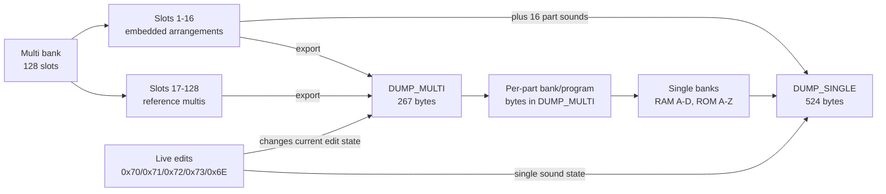

# Access Virus (TI mk2)

[Docs index](README.md) · [Root README](../README.md)

General notes about Access Virus TI mk2 desktop architecture, storage, and
front-panel modes.

Note: Currently applies only to Access Virus TI mk2 desktop (not keyboard/Polar).

## Architecture map

## Banks and programs

The TI mk2 provides **four RAM banks** (A–D). Each bank holds **128 Single programs**.

| Bank  | Role     |
| ----- | -------- |
| RAM A | User RAM |
| RAM B | User RAM |
| RAM C | User RAM |
| RAM D | User RAM |

There are also **26 ROM banks** (ROM A through ROM Z), each with **128 factory Singles**.

In each Multi, every part stores a **bank index** and **program number**
pointing at a Single. The encoding is documented in
[multis-dump.md](multis-dump.md#part-bank-index).

## SysEx dump types

The Virus can export or stream several kinds of MIDI SysEx data:

| #   | Name                | Description                                                          | Project interest                           |
| --- | ------------------- | -------------------------------------------------------------------- | ------------------------------------------ |
| 1   | **Single Buffer**   | One Single in the temporary edit buffer                              | Secondary — relates to arrangement exports |
| 2   | **Single Bank**     | All 128 programs in a RAM bank (A–D)                                 | Secondary                                  |
| 3   | **Controller Dump** | One Single as a sequence of parameter changes (CC or SysEx)          | Secondary                                  |
| 4   | **Arrangement**     | Current Multi (or sequencer) buffer: **multi settings + 16 Singles** | Important — full performance snapshot      |
| 5   | **Multi Bank**      | All programs in the Multi bank (128 slots)                           | Important                                  |
| 6   | **Remote Patches**  | Remote control templates                                             | Out of scope                               |

**Multi bank export:** one **`DUMP_MULTI`** (267 bytes) for every slot.
**Slots 1–16** also include **sixteen `DUMP_SINGLE`** messages (524 bytes
each) — the full part sounds are stored with the multi. **Slots 17–128**
return the 267-byte multi settings only (bank/program pointers per part in
that header). The **edit buffer** (`REQUEST` bank `00` slot `7F`) uses the
same 267-byte block; it may be exported with sixteen singles like slots
1–16.

Message-level layouts:

- Multi dump: [multis-dump.md](multis-dump.md)
- Single dump: [single-dump.md](single-dump.md)
- Live multi edits (not full dumps): [multis-live-edit.md](multis-live-edit.md)

## Multi bank (TI series)

See [multis-dump.md — Embedded vs Reference Multis](multis-dump.md#embedded-vs-reference-multis).

## Front-panel modes (observed SysEx)

The TI desktop exposes **Multi**, **Single**, and **Sequencer** (combined
**MULTI+SINGLE**) play/edit modes. Mode changes can emit global SysEx
(**`cmd=0x73`**, param **`0x10`**) — see
[global-live-edit.md — Edit mode 0x10](global-live-edit.md#edit-mode-0x10-tentative).

| Panel action                 | Typical SysEx from Virus          |
| ---------------------------- | --------------------------------- |
| Select multi from bank       | `73 00 10 00` (often twice)       |
| Press **SINGLE**             | `73 40 10 00`                     |
| **MULTI+SINGLE** / Sequencer | Empty `F0 F7` frames (no payload) |

This is separate from **parameter edits** (e.g. Filter Cutoff uses
**`cmd=0x70`** while editing a Single on Part 1).
